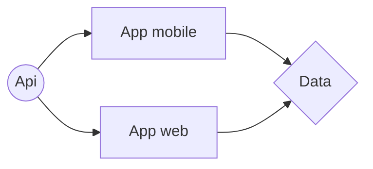

# AREA

AREA est une business application permettant de relier des services afin d'automatiser des taches entre elles.

# SOMMAIRE

- Info
- Installation
- Schéma Technique

# INFO

- **Membre du group** : Riyad Harone Thomas Tiziano
- **Date Du Projet** : 19/01/2022 au 06/03/2022
- **Langage** : React.js, ReactNative.js,Node.js

# INSTALLATION

- Prérequis.

  > Docker

- Taper les commandes.

  > docker-compose build && docker-compose up

- Lancer l'application.
  > http://localhost/8081

# SCHÉMA TECHNIQUE

